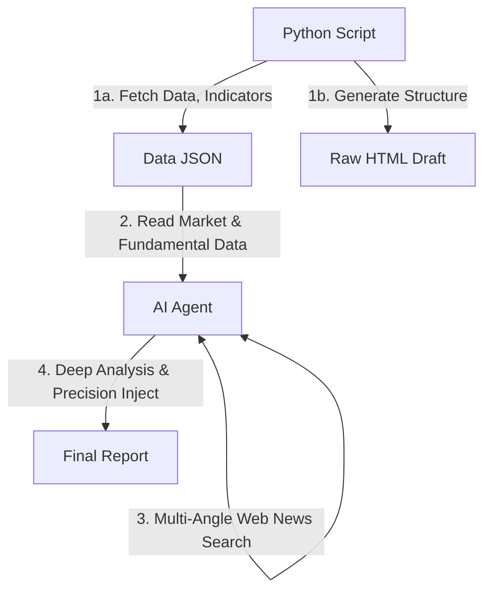
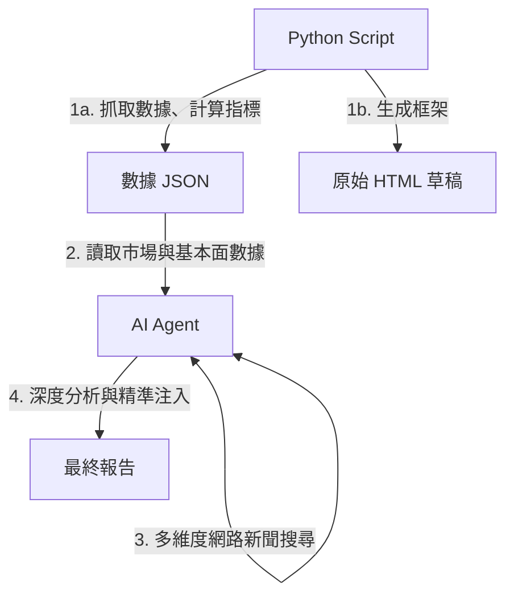

# Investment Analysis Automation

This is an investment assistance tool that combines **Python automation scripts** with **AI-powered analysis**. It is designed to automatically fetch data from the US and Taiwan stock markets (ETFs) and bond markets, calculate key technical indicators, generate K-line charts, and produce in-depth market insights and real-time news summaries with the help of an AI agent, ultimately delivering an easy-to-read comprehensive HTML analysis report. Of course, the frequency of execution and the data to be collected each time can be fully customized by the user.

# 投資分析自動化專案

這是一個結合 **Python 自動化腳本** 與 **AI 智慧分析** 的投資輔助工具。旨在自動抓取美股、台股 ETF 及債券市場數據，計算關鍵技術指標，繪製 K 線圖，並結合 AI 代理人生成深度市場觀點與即時新聞彙整，最終產出一份易於閱讀的 HTML 綜合分析報告。當然，一週要觸發多少次，以及每次要收集哪些資料，完全可以由使用者自行調整。

---

## 更新紀錄 (Changelog)

- **2026-02-27**:
  - **規範更新**: 於 `GEMINI.md` 中明確化 `README.md` 的更新觸發條件，僅限修改 Source Code 或 `GEMINI.md` 本身時才執行變更紀錄。
- **2026-02-26**:
  - 使用 `technical_data.json` 存放技術分析數據，不再直接寫入報告中，減輕AI再次分析報告時的負擔。
- **2026-02-25**: 
  - 修正市場狀態判定邏輯：改善 `yf.download` 呼叫參數並改以週末判定休市，解決台股與美股誤報「休市中」的問題。
  - 調整專案文件：將 `GEMINI.md` 全面翻譯為英文，並將 `README.md` 的更新紀錄搬移至檔頭以提升可讀性。

---

## Live Demo (操作示範)

[](https://www.youtube.com/watch?v=lfzpw7sPqhI)

---

## Key Features

1.  **Multi-Market Data Tracking**: Supports tracking of US stock indices (e.g., S&P 500, Philadelphia Semiconductor Index), popular Taiwan ETFs (e.g., 0050, 0056), individual stocks, and bond ETFs.
2.  **Automated Technical Indicator Calculation**:
    *   **KD (Stochastic Oscillator)**: To identify overbought/oversold zones and trend strength.
    *   **Bias Ratio (BIAS)**: Calculates 5-day, 20-day, and 60-day BIAS to determine if the stock price is overheated or oversold.
    *   **DMI & ADX**: To determine the direction and strength of bullish/bearish trends.
    *   **Moving Averages (MA)**: Calculates 5MA, 20MA, and 60MA.
3.  **Visual Chart Generation**: Automatically generates K-line charts including moving averages and volume, as well as the US Treasury yield curve chart.
4.  **Independent Financial Focus Section**:
    *   Automatically collects real, important news related to the US/Taiwan economy, foreign exchange, and interest rates, providing links and summaries for users to quickly grasp market trends.
    *   Placed in a dedicated **`#weekly-news-focus`** block.
5.  **AI-Powered In-Depth Comprehensive Analysis**:
    *   The report includes a dedicated **`#ai-analysis-report`** block.
    *   **Technical Analysis**: Analyzes price-volume structure and indicator divergences.
    *   **Fundamental Analysis**: Uses financial statement data to evaluate economic moats and margin of safety.
    *   **Macroeconomic Analysis**: Interprets market cycles by combining automatically fetched macroeconomic data.
6.  **Professional-Grade Report Style**:
    *   **Strict No-Emoji Policy**: No emojis are used in code logs or report content to ensure a professional and clean output.
    *   **Taiwan Stock Market Convention**: Adopts the red-for-up, green-for-down K-line color convention, aligning with local user habits.
7.  **Macroeconomic Indicator Monitoring**: Automatically tracks key US and Taiwan economic data, including:
    *   **United States**: GDP growth rate, CPI (Consumer Price Index), PPI (Producer Price Index), Retail Sales, Non-farm Payrolls, Unemployment Rate, Initial Jobless Claims, ISM Manufacturing Index, M2 Money Supply, Credit Card Delinquency Rate, Real Private Investment, US Dollar Index (DXY).
    *   **Taiwan**: Monitoring Indicator (Signal), Export Orders YoY, Industrial Production Index, Consumer Confidence Index (CCI), M1B & M2 Money Supply, Credit Card Delinquency Rate, Real Private Investment, Unemployment Rate, Overtime Hours, Margin Purchase Balance, Short Sale Balance.
8.  **Financial News Aggregation**.

## 主要功能

1.  **多市場數據追蹤**：支援追蹤美股指數（如 S&P 500, 費半）、台股熱門 ETF（如 0050, 0056）、個股及債券 ETF。
2.  **自動化技術指標計算**：
    *   **KD 指標**：判斷超買/超賣區間與趨勢強弱。
    *   **乖離率 (BIAS)**：計算 5日、20日、60日 乖離，判斷股價是否過熱或超跌。
    *   **DMI & ADX**：判斷多/空趨勢方向與強度。
    *   **移動平均線 (MA)**：計算 5MA, 20MA, 60MA。
3.  **視覺化圖表生成**：自動繪製包含均線與成交量的 K 線圖，以及美國長短期公債殖利率曲線圖。
4.  **獨立的財經焦點專區**：
    *   自動收集與美台經濟、匯率、利率相關的真實重要新聞，提供連結與摘要，讓使用者快速掌握市場脈動。
    *   放置在專屬的 **`#weekly-news-focus`** 區塊。
5.  **AI 深度綜合分析**：
    *   報告包含專屬的 **`#ai-analysis-report`** 區塊。
    *   **技術面**：分析量價結構與指標背離。
    *   **基本面**：運用財報數據評估護城河與安全邊際。
    *   **總經面**：結合自動抓取的宏觀數據解讀市場週期。
6.  **專業級報告風格**：
    *   嚴格執行 **No-Emoji Policy**：程式碼日誌與報告內容均不使用表情符號，確保輸出的專業性與簡潔度。
    *   採用 **台股紅漲綠跌** 的 K 線配色慣例，符合本地使用者習慣。
7. **總體經濟指標監控**：自動追蹤美台核心經濟數據，包含：
    *   **美國**：GDP 成長率、CPI (消費者物價指數)、PPI (生產者物價指數)、零售銷售、非農就業人數、失業率、初次請領失業救濟金人數、ISM 製造業指數、M2 貨幣供給、信用卡違約率、實質民間投資、美元指數 (DXY)。
    *   **台灣**：景氣對策信號 (燈號)、外銷訂單年增率、工業生產指數、消費者信心指數 (CCI)、M1B & M2 貨幣供給、信用卡違約率 (逾期比)、實質民間投資、失業率、加班工時、融資餘額、融券餘額。
8. **財經新聞彙整**：

---

## Authoritative Data Sources

To ensure the professionalism and accuracy of the analysis, this project strictly limits the AI Agent to fetching the latest **officially released data** from government statistical agencies. The use of forecasts or unofficial estimates is strictly prohibited.

### 1. Macroeconomic Data
*   **United States (US)**:
    *   **BEA (Bureau of Economic Analysis)**: GDP, Real Private Investment.
    *   **BLS (Bureau of Labor Statistics)**: CPI, PPI, Non-farm Payrolls, Unemployment Rate.
    *   **U.S. Census Bureau**: Retail Sales.
    *   **U.S. Department of Labor**: Initial Jobless Claims.
    *   **ISM (Institute for Supply Management)**: ISM Manufacturing Index.
    *   **Federal Reserve**: M2 Money Supply, Delinquency Rate.
    *   **Yahoo Finance**: US Dollar Index (DXY).
    *   **Alpha Vantage**: Treasury Yields (primary source, with Yahoo Finance as fallback).
*   **Taiwan**:
    *   **National Development Council (NDC)**: [Monitoring Indicator (Signal)](https://index.ndc.gov.tw/n/zh_tw) (ensuring the latest score and color), Export Orders YoY.
    *   **Ministry of Economic Affairs**: Industrial Production Index.
    *   **Central Bank**: M1B & M2 Money Supply.
    *   **Financial Supervisory Commission (FSC)**: Credit Card Delinquency Rate.
    *   **Research Center for Taiwan Economic Development, National Central University**: Consumer Confidence Index (CCI).
    *   **Directorate-General of Budget, Accounting and Statistics**: Real Private Investment (Gross Fixed Capital Formation), Unemployment Rate, Overtime Hours.
    *   **Taiwan Stock Exchange (TWSE)**: Margin Purchase Balance, Short Sale Balance.

### 2. Real-time News and Market Data
*   **Market Data**: Directly calls the **Yahoo Finance (yfinance) API** to obtain historical prices, technical indicators, and fundamental data from financial statements.
*   **Financial News**: Adheres to a strict **News Verification Protocol** to ensure the authenticity and accuracy of every news item.

## 權威資料來源 (Authoritative Data Sources)

為了確保分析的專業性與準確性，本專案嚴格限制 AI Agent 僅能從各國政府官方統計機構獲取最新的**正式發布數據**，嚴禁使用預測值或非官方估計。

### 1. 總體經濟數據 (Macro Data)
*   **美國 (US)**:
    *   **BEA (經濟分析局)**: GDP (國內生產總值)、實質民間投資。
    *   **BLS (勞工統計局)**: CPI (消費者物價指數)、PPI (生產者物價指數)、非農就業人數、失業率。
    *   **美國商務部**: 零售銷售。
    *   **美國勞工部**: 初次請領失業救濟金人數。
    *   **ISM (供應管理協會)**: ISM 製造業指數。
    *   **Federal Reserve (聯準會)**: M2 貨幣供給、信用卡違約率 (Delinquency Rate)。
    *   **Yahoo Finance**: 美元指數 (DXY)。
    *   **Alpha Vantage**: 公債殖利率 (主要來源，Yahoo Finance 作為備援)。
*   **台灣 (Taiwan)**:
    *   **國發會**: [景氣對策信號 (燈號)](https://index.ndc.gov.tw/n/zh_tw) (確保獲取最新分數與顏色)、外銷訂單年增率。
    *   **經濟部**: 工業生產指數。
    *   **中央銀行**: M1B & M2 貨幣供給。
    *   **金管會**: 信用卡逾期帳款比率 (違約率)。
    *   **中央大學台灣經濟發展研究中心**: 消費者信心指數 (CCI)。
    *   **主計總處**: 實質民間投資 (固定資本形成)、失業率、加班工時。
    *   **證交所 (TWSE)**: 融資餘額、融券餘額。

### 2. 即時新聞與市場數據 (Real-time Context)
*   **市場數據**: 直接調用 **Yahoo Finance (yfinance) API** 獲取歷史價格、技術指標與企業財報基本面數據。
*   **財經新聞**: 遵循嚴格的 **新聞查核協議 (News Verification Protocol)**，確保每則新聞的真實性與準確性。

---

## News Verification Protocol

To prevent AI from hallucinating or fetching incorrect information, this project implements the following verification measures:

### 1. Tier-1 Source Whitelist
The AI Agent is only allowed to gather information from the following global and local mainstream financial media outlets:
*   **Global**: Bloomberg, Reuters, The Wall Street Journal (WSJ), Financial Times, CNBC, Barron's.
*   **Taiwan**: Economic Daily News (經濟日報), Commercial Times (工商時報), Central News Agency (CNA), Anue (鉅亨網).
*   **Strictly Prohibited**: Social media (e.g., X/Facebook), personal blogs, content farms, or any unprofessional websites with sensationalist titles.

### 2. Triangulation and Data Consistency
*   **Triangulation**: For major market events (e.g., Fed decisions, key economic data), the AI must find reports from at least **two** different media sources before adopting the information.
*   **Recency Check**: All news must be published within the last **7 days** to avoid reposting old information.
*   **Consistency Check**: The economic indicator values in the news content must be consistent with the "official macro data" fetched in this report. If there is a conflict, the AI must prioritize the official data and discard the news item.
*   **Verifiability**: Every news item must include a **direct link** to the original article for manual verification.

## 新聞查核機制 (News Verification Protocol)

為了防止 AI 產生幻覺或抓取錯誤資訊，本專案實施以下查核措施：

### 1. 權威媒體白名單 (Tier-1 Source Whitelist)
AI Agent 僅能從以下全球及本土主流財經媒體搜集資訊：
*   **全球 (Global)**: Bloomberg, Reuters, The Wall Street Journal (WSJ), Financial Times, CNBC, Barron's.
*   **台灣 (Taiwan)**: 經濟日報、工商時報、中央通訊社 (CNA)、鉅亨網 (Anue)。
*   **嚴格禁制**: 社交媒體 (如 X/Facebook)、個人部落格、內容農場、或任何標題誇張的非專業網站。

### 2. 多重驗證與數據一致性
*   **交叉比對 (Triangulation)**: 對於重大市場事件 (如聯準會決策、關鍵經濟數據)，AI 必須同時找到 **2 家以上** 不同媒體體系的報導才可採納。
*   **時效性檢查 (Recency Check)**: 所有新聞發布時間必須在 **7 天內**，避免舊聞重貼。
*   **數據一致性 (Consistency Check)**: 新聞內容中的經濟指標數值必須與本報告中抓取的「官方總經數據」一致。若有衝突，AI 必須優先採納官方數據並捨棄該則新聞。
*   **強烈真實性 (Verifiability)**: 每一則新聞都必須附帶指向原文的 **直接來源連結** (Direct Link)，方便人工複查。

---

## Project Structure

*   `investment_analysis.py`: The core Python script. Responsible for fetching `yfinance` data, calculating indicators, generating charts, and producing the HTML report via the `jinja2` template engine.
*   `templates/`: Contains the HTML report template (`report_template.html`), separating the report's format from its logic.
*   `config.json`: Configuration file. Manages the tracking list, group classifications, and Chinese name mappings.
*   `report/`: Stores the generated daily HTML reports (filename format: `invest_analysis_YYYYMMDD.html`).
*   `GEMINI.md`: Defines the AI Agent's collaboration logic, macro data fetching rules, and automation workflow.
*   `requirements.txt`: The project's dependency list.
*   `README.md`: This project description file.

## 專案結構

*   `investment_analysis.py`: 核心 Python 腳本。負責抓取 `yfinance` 數據、計算指標、繪圖，並透過 `jinja2` 模板引擎產出 HTML 報告。
*   `templates/`: 存放 HTML 報告模板 (`report_template.html`)，讓報告格式與邏輯分離。
*   `config.json`: 設定檔。管理追蹤清單、群組分類與中文名稱對照。
*   `report/`: 存放生成的 HTML 日報 (檔名格式：`invest_analysis_YYYYMMDD.html`)。
*   `GEMINI.md`: 定義 AI Agent 的協作邏輯、總經數據抓取規則與自動化流程。
*   `requirements.txt`: 專案依賴清單。
*   `README.md`: 專案說明文件。

---

## How It Works & Workflow

This project uses a "two-stage processing" architecture, combining Python's data processing capabilities with AI's analytical logic.



This project is recommended to be used with an AI Agent (like Gemini CLI) for the full experience. The workflow is as follows:

1.  **Execute the Script**: Have the AI Agent (or manually) run `investment_analysis.py`.
    *   The program reads `config.json`.
    *   Fetches historical stock price data and indicators.
    *   **Data Decoupling**: Saves structured data to `technical_data.json`.
    *   Renders `templates/report_template.html` using `jinja2`.
    *   Generates charts based on the data and embeds them into the HTML file as Base64.
    *   Generates a raw report (HTML file) with empty data placeholders.
2.  **AI Analysis and Injection** (performed by the AI Agent):
    *   Reads `technical_data.json` for technical and fundamental indicators.
    *   **Information Gathering**: Performs multiple searches (US macro, Taiwan tech, risks & earnings) to find the latest real news.
    *   **Content Generation**: Writes the "Weekly Financial Focus" and "AI Comprehensive Analysis" (including technical, fundamental, and macroeconomic aspects).
    *   **Precision Injection**: Runs `update_report.py` to:
        *   Inject macro indicators into `us-macro-placeholder` and `tw-macro-placeholder`.
        *   Inject news content into `#weekly-news-focus`.
        *   Inject the analysis report into `#ai-analysis-report`.

## 運作方式與流程

本專案採用「雙階段處理」架構，結合 Python 的數據處理能力與 AI 的邏輯分析能力。



本專案建議搭配 AI Agent (如 Gemini CLI) 使用以獲得完整體驗。運作流程如下：

1.  **執行腳本**：讓 AI Agent (或手動) 執行 `investment_analysis.py`。
    *   程式讀取 `config.json`。
    *   抓取歷史股價數據與指標。
    *   **數據分離**：將結構化數據儲存至 `technical_data.json`。
    *   使用 `jinja2` 渲染 `templates/report_template.html`。
    *   根據數據繪製圖表並轉換為 Base64 嵌入 HTML 檔案中。
    *   生成包含數據表格與圖表的原始報告 (HTML 檔案)，且資料標籤為空。
2.  **AI 分析與注入** (由 AI Agent 完成)：
    *   讀取 `technical_data.json` 中的各項技術與基本面指標。
    *   **資訊搜集**：執行多重搜尋（美股總經、台股科技、風險與財報）尋找最新真實新聞。
    *   **內容生成**：撰寫「本週財經焦點」與「AI 綜合分析」（含技術、基本、總經面）。
    *   **精準注入**：執行 `update_report.py` 進行：
        *   總經指標注入至 `us-macro-placeholder` 與 `tw-macro-placeholder`。
        *   新聞內容注入至 `#weekly-news-focus`。
        *   分析報告注入至 `#ai-analysis-report`。

---

## Installation & Setup

### 1. Clone the Project
Clone the project to your local workspace:
```bash
git clone https://github.com/GwanlinHo/investment_analysis.git
cd investment_analysis
```

### 2. Environment Requirements & Setup
*   Python 3.9 or higher.
*   It is recommended to use **uv** (a modern Python packager) for optimal performance:
    ```bash
    # Run with uv (manages environment automatically)
    uv run investment_analysis.py
    ```
*   Traditional pip method:
    ```bash
    python3 -m venv .venv
    source .venv/bin/activate  # Linux/macOS
    pip install -r requirements.txt
    python3 investment_analysis.py
    ```

### 3. API Keys (Optional)
To enable programmatic data fetching (reduces reliance on AI web search):
*   **FRED API**: Set `FRED_API_KEY` environment variable or add to `config.json > api_keys.fred`. Get a free key at [https://fred.stlouisfed.org/docs/api/api_key.html](https://fred.stlouisfed.org/docs/api/api_key.html).
*   **Alpha Vantage**: Set `ALPHA_VANTAGE_API_KEY` environment variable or add to `config.json > api_keys.alpha_vantage`. Get a free key at [https://www.alphavantage.co/support/#api-key](https://www.alphavantage.co/support/#api-key).

Without API keys, the system gracefully falls back to yfinance or AI web search.

### 4. Configure the Tracking List (`config.json`)
You can customize the assets you want to track by modifying `config.json`. The file structure is as follows:

*   **`stock_groups`**: Defines the classification groups in the report.
    ```json
    {
      "title": "Group Name (e.g., US Stocks)",
      "symbols": ["Ticker1", "Ticker2", ...],
      "description": "Group Description"
    }
    ```
*   **`key_indicators`**: Defines which assets will appear in the "Market Snapshot" section at the top of the report.
*   **`symbol_name_map`**: Defines the Chinese names corresponding to the stock tickers (if not set, the ticker is displayed).

**Modification Example**: To add "Tesla (TSLA)" for tracking, add `"TSLA"` to the corresponding array in `stock_groups`, and add `"TSLA": "特斯拉"` to `symbol_name_map`.

## 安裝與設定

### 1. 複製專案
請將專案複製到您的本地工作區域：
```bash
git clone https://github.com/GwanlinHo/investment_analysis.git
cd investment_analysis
```

### 2. 環境需求與設定
*   Python 3.9 或以上版本。
*   推薦使用 **uv** (現代化 Python 封裝工具) 以獲得最佳效能：
    ```bash
    # 使用 uv 執行 (自動管理環境)
    uv run investment_analysis.py
    ```
*   傳統 pip 方式：
    ```bash
    python3 -m venv .venv
    source .venv/bin/activate  # Linux/macOS
    pip install -r requirements.txt
    python3 investment_analysis.py
    ```

### 3. API 金鑰設定 (選配)
啟用程式化資料抓取 (減少對 AI 網路搜尋的依賴)：
*   **FRED API**: 設定環境變數 `FRED_API_KEY` 或填入 `config.json > api_keys.fred`。免費申請：[https://fred.stlouisfed.org/docs/api/api_key.html](https://fred.stlouisfed.org/docs/api/api_key.html)。
*   **Alpha Vantage**: 設定環境變數 `ALPHA_VANTAGE_API_KEY` 或填入 `config.json > api_keys.alpha_vantage`。免費申請：[https://www.alphavantage.co/support/#api-key](https://www.alphavantage.co/support/#api-key)。

未設定 API 金鑰時，系統會自動降級至 yfinance 或 AI 網路搜尋。

### 4. 設定追蹤清單 (`config.json`)
您可以透過修改 `config.json` 來自定義想追蹤的標的。檔案結構如下：

*   **`stock_groups`**: 定義報告中的分類群組。
    ```json
    {
      "title": "群組名稱 (如：美股)",
      "symbols": ["代碼1", "代碼2", ...],
      "description": "群組描述"
    }
    ```
*   **`key_indicators`**: 定義哪些標的會出現在報告最上方的「市場速覽」區塊。
*   **`symbol_name_map`**: 定義股票代碼對應的中文名稱 (若未設定則顯示代碼)。

**修改範例**：若要新增追蹤「特斯拉 (TSLA)」，請在 `stock_groups` 的對應陣列中加入 `"TSLA"`，並在 `symbol_name_map` 加入 `"TSLA": "特斯拉"`。

---

## Automation

You can set up `crontab` to automatically run the analysis and upload the report at scheduled times.

### 1. Create an Execution Script
Create a file (e.g., `run_analysis.sh`) and paste the following content (please modify the paths according to your environment):

```bash
#!/bin/bash
export PATH=$PATH:/home/pi/.config/nvm/versions/node/v22.17.0/bin
cd /home/pi/WorkDir/investment_analysis/
gemini -p 'investment analysis' -y
```

### 2. Set up Crontab
Run `crontab -e` and add the following schedule (e.g., runs at 10 PM from Monday to Friday):

```bash
0 22 * * 1-5 /bin/bash /home/pi/WorkDir/investment_analysis/run_analysis.sh >> /home/pi/WorkDir/investment_analysis/auto_run.log 2>&1
```

## 自動化執行 (Automation)

您可以透過設定 `crontab` 來實現定時自動執行分析並上傳報告。

### 1. 建立執行腳本
建立一個檔案 (例如 `run_analysis.sh`) 並貼入以下內容 (請根據您的環境修改路徑)：

```bash
#!/bin/bash
export PATH=$PATH:/home/pi/.config/nvm/versions/node/v22.17.0/bin
cd /home/pi/WorkDir/investment_analysis/
gemini -p 'investment analysis' -y
```

### 2. 設定 Crontab
執行 `crontab -e` 並加入以下排程 (例如：每週一至五 晚上 10 點執行)：

```bash
0 22 * * 1-5 /bin/bash /home/pi/WorkDir/investment_analysis/run_analysis.sh >> /home/pi/WorkDir/investment_analysis/auto_run.log 2>&1
```

---

## AI Agent Collaboration Guide

The core value of this project lies in the combination of **"automated code" and "AI analytical capabilities"**. Let the Python script collect and calculate data, and let the AI Agent gather the latest news, interpret market sentiment, and conduct in-depth analysis.

### 1. Gemini CLI Collaboration Mode (Default)

This project has built-in integration settings for Gemini CLI.

*   **Trigger Mechanism**:
    You just need to type the keyword in Gemini CLI: **`investment analysis`**.
*   **How It Works**:
    The `GEMINI.md` file in the project (or `.gemini/GEMINI.md`) acts as a "System Prompt." When the AI reads this file, it knows that when the user inputs the specific keyword, it must perform the following actions in order:
    1.  **Execute Script**: `python3 investment_analysis.py`.
    2.  **Read File**: Read the content of the generated raw report.
    3.  **Web Search**: Use Google Search to find recent real news about US stocks, Taiwan stocks, and foreign exchange markets (with source links).
    4.  **Role-Play Analysis**: Switch between three personas—(1) Technical Analyst, (2) Value Analyst, and (3) Macro Analyst—for a multi-angle analysis.
    5.  **Write to File**: Write the news and analysis results back into the raw report to form a complete report.
    6.  **Git Operations**: Automatically upload the report to the remote (GitHub) server.

### 2. Collaboration with Other AI Agents (e.g., Claude Code, Codex, Cursor)

This "File-based Context Injection" concept can be easily ported to other AI programming tools.

## AI Agent 協作指南 (AI Agent Collaboration Guide)

本專案的核心價值在於**「自動化程式碼」與「AI 分析能力」的結合**。讓 Python 腳本收集並且計算數據，讓 AI Agent 蒐集最新的新聞、解讀市場情緒，並且進行深入的分析。

### 1. Gemini CLI 協作模式 (預設)

本專案已內建 Gemini CLI 的整合設定。

*   **觸發機制**：
    您只需要在 Gemini CLI 中輸入關鍵字：**`investment analysis`**。
*   **背後原理**：
    專案中的 `GEMINI.md` (或 `.gemini/GEMINI.md`) 扮演了「系統提示詞 (System Prompt)」的角色。當 AI 讀取到此檔案時，它會知道當使用者輸入特定關鍵字時，必須依序執行以下動作：
    1.  **執行腳本**：`python3 investment_analysis.py`。
    2.  **讀取檔案**：讀取生成的原始報告內容。
    3.  **網路搜尋**：使用 Google Search 尋找近期美股、台股與匯市的真實新聞（且附上來源連結）。
    4.  **角色扮演分析**：切換成 (1)技術分析、(2)價值分析、(3)宏觀分析 三種人格進行多角度分析。
    5.  **寫入檔案**：將新聞與分析結果寫回原始報告中，形成完整的報告。
    6.  **Git 操作**：自動上傳報告到遠端(github)伺服器。

### 2. 搭配其他 AI Agent (如 Claude Code, Codex, Cursor)

這套「以檔案為基礎的上下文注入 (File-based Context Injection)」概念可以輕易移植到其他 AI 程式設計工具。

---

## Report Reading Guide

The generated HTML report contains the following key information:

### Navigation Bar Features
The top of the report provides quick navigation buttons, including:
*   **US Stocks / Taiwan Stocks / Bonds**: Quickly jump to market quotes and K-line charts for each market.
*   **Macro Info**: View the US Treasury yield curve and key economic indicator tables for the US and Taiwan.
*   **Financial Focus**: Browse summaries of this week's important financial news.
*   **AI Analysis**: Read the AI's comprehensive assessment of technical, fundamental, and macroeconomic aspects.

### 1. Technical Signal Badges
| Signal | Color | Meaning | Logic |
| :--- | :--- | :--- | :--- |
| **Bullish Alignment** | <span style="color:red">Red</span> | Strong Uptrend | K > D and Monthly BIAS > 0 |
| **Rebound** | <span style="color:lightcoral">Light Red</span> | Weak Rebound | K > D but Monthly BIAS < 0 |
| **Pullback Consolidation** | <span style="color:lightgreen">Light Green</span> | Bullish Pullback | K < D but Monthly BIAS > 0 |
| **Bearish Correction** | <span style="color:green">Green</span> | Downtrend | K < D and Monthly BIAS < 0 |

### 2. Key Indicator Interpretation
*   **K9 / D9**: KD Stochastic Oscillator.
    *   **> 80**: Overbought zone (potential for a pullback, but also could indicate a strong trend).
    *   **< 20**: Oversold zone (potential for a rebound).
    *   **K > D**: Golden cross (bullish).
    *   **K < D**: Death cross (bearish).
*   **Bias Ratio (BIAS)**: The percentage distance between the stock price and its moving average.
    *   **Positive value**: Price is above the moving average. **Negative value**: Price is below the moving average.
    *   An excessively large value indicates short-term overheating or being oversold.
*   **ADX**: Trend strength indicator. A higher value indicates a stronger current trend (regardless of direction). Typically, > 25 indicates a clear trend.
*   **+DI / -DI**: Directional indicators. +DI above -DI indicates bullish dominance; -DI above +DI indicates bearish dominance.
*   **Volume Ratio %**: The ratio of the current day's trading volume to the average trading volume over the past 20 days.
    *   **> 100%**: Today's volume is greater than the 20-day average, indicating strengthening momentum.
    *   **< 100%**: Today's volume is less than the 20-day average, indicating weakening momentum.
*   **Yield Curve Inversion**:
    *   An abnormal phenomenon where short-term government bond yields are higher than long-term bond yields.
    *   Historically considered a leading indicator of an **economic recession** (because the market expects future interest rates to fall, causing long-term bond yields to decrease).

### 3. Macro Dashboard
The report lists key macro data for the US and Taiwan to help assess the overall environmental risk:
*   **Trend Arrows (▲/▼)**: Intuitively show the direction of change from the previous period or expectation.
*   **Color Coding**:
    *   <span style="color:red">Red</span>: Usually represents positive expansion (e.g., GDP increase, better economic signal) or a bullish signal (e.g., increased margin financing).
    *   <span style="color:green">Green</span>: Usually represents contraction, improvement (e.g., lower unemployment), or a risk-off signal.
*   **Monitoring Indicator**: Released by Taiwan's NDC. A yellow-red/red light indicates a booming economy, while a blue light indicates a slump.
*   **Margin/Short Balance**: To observe market sentiment and retail investor positioning.

### 4. Four AI In-Depth Analysis Perspectives
*   **1. Macro Environment Setting**: Tells you which stage of the economic cycle the broader environment is in (expansion/recession/inflation).
*   **2. Market Dynamics & Industry Trends**: Focuses on **capital flow** (e.g., the impact of the US dollar on foreign investment) and **industry valuation** (e.g., correction risk for tech stocks).
*   **3. Technical & Individual Stock Health Check**: Analyzes price-volume indicators and fundamental quality for specific assets.
*   **4. Comprehensive Strategy & Scenario Forecasting**: Provides **concrete action plans** for different market scenarios (bullish/neutral/bearish).

## 報告閱讀指南

生成的 HTML 報告包含以下關鍵資訊：

### 導覽列功能
報告頂部提供快速導覽按鈕，包含：
*   **美股 / 台股 / 債券**：快速跳轉至各市場報價與 K 線圖。
*   **總經資訊**：查看美國公債殖利率曲線及美台重要經濟指標表格。
*   **財經焦點**：瀏覽本週重要財經新聞摘要。
*   **AI分析**：閱讀 AI 針對技術面、基本面與總經面的綜合評估。

### 1. 技術訊號徽章 (Badges)
| 訊號 | 顏色 | 意義 | 判斷邏輯 |
| :--- | :--- | :--- | :--- |
| **多頭排列** | <span style="color:red">紅色</span> | 強勢上漲 | K > D 且 月線乖離 > 0 |
| **反彈** | <span style="color:lightcoral">淡紅</span> | 弱勢反彈 | K > D 但 月線乖離 < 0 |
| **回檔整理** | <span style="color:lightgreen">淡綠</span> | 多頭回調 | K < D 但 月線乖離 > 0 |
| **空頭修正** | <span style="color:green">綠色</span> | 趨勢向下 | K < D 且 月線乖離 < 0 |

### 2. 關鍵指標解讀
*   **K9 / D9**: KD 隨機指標。
    *   **> 80**: 超買區 (可能回檔，但也可能鈍化強漲)。
    *   **< 20**: 超賣區 (可能反彈)。
    *   **K > D**: 黃金交叉 (偏多)。
    *   **K < D**: 死亡交叉 (偏空)。
*   **乖離率 (BIAS)**: 股價與均線的距離百分比。
    *   **正值**: 股價在均線上。**負值**: 股價在均線下。
    *   數值過大代表短線過熱或超跌。
*   **ADX**: 趨勢強度指標。數值越高代表目前趨勢（無論多空）越強。通常 > 25 代表有明顯趨勢。
*   **+DI / -DI**: 方向指標。+DI 在上代表多方佔優，-DI 在上代表空方佔優。
*   **量比%**: 當日成交量與過去 20 日平均成交量的比值。
    *   **> 100%**: 代表今日成交量大於 20 日均量，動能增強。
    *   **< 100%**: 代表今日成交量小於 20 日均量，動能縮減。
*   **殖利率倒掛 (Yield Curve Inversion)**:
    *   指「短期公債殖利率」高於「長期公債殖利率」的異常現象。
    *   歷史上常被視為**經濟衰退**的領先指標 (因為市場預期未來利率會下降，導致長債殖利率走低)。

### 3. 總體經濟數據儀表板 (Macro Dashboard)
報告中列出美國與台灣的關鍵總經數據，協助判斷大環境風險：
*   **趨勢箭頭 (▲/▼)**：直觀呈現數據較前一期或預期的增減方向。
*   **顏色編碼**：
    *   <span style="color:red">紅色</span>：通常代表正向擴張（如 GDP 增加、景氣燈號好轉）或偏多訊號（如融資增加）。
    *   <span style="color:green">綠色</span>：通常代表收縮、改善（如失業率下降）或避險訊號。
*   **景氣對策信號**：台灣國發會發布，黃紅燈/紅燈代表景氣熱絡，藍燈代表低迷。
*   **融資/融券餘額**：觀測市場籌碼面與散戶情緒。

### 4. 四大 AI 深度分析視角
*   **1. 宏觀環境定調**: 告訴你大環境處於經濟週期的哪個階段 (擴張/衰退/通膨)。
*   **2. 市場動態與產業趨勢**: 核心觀察**資金流向** (如美元對外資的影響) 與**產業估值** (如科技股回調風險)。
*   **3. 技術面與個股健檢**: 針對具體標的進行量價指標解析與基本面品質評估。
*   **4. 綜合對策與情境預測**: 提供不同市場情境下的**具體行動建議** (樂觀/中立/悲觀)。

---

## ⚠️ Disclaimer
The reports generated by this project are for research and reference purposes only and do not constitute any investment advice. Financial markets are unpredictable; please conduct your own thorough risk assessment before investing.

## ⚠️ 免責聲明
本專案生成的報告僅供研究與參考，不構成任何投資建議。金融市場變化莫測，投資前請務必自行審慎評估風險。
